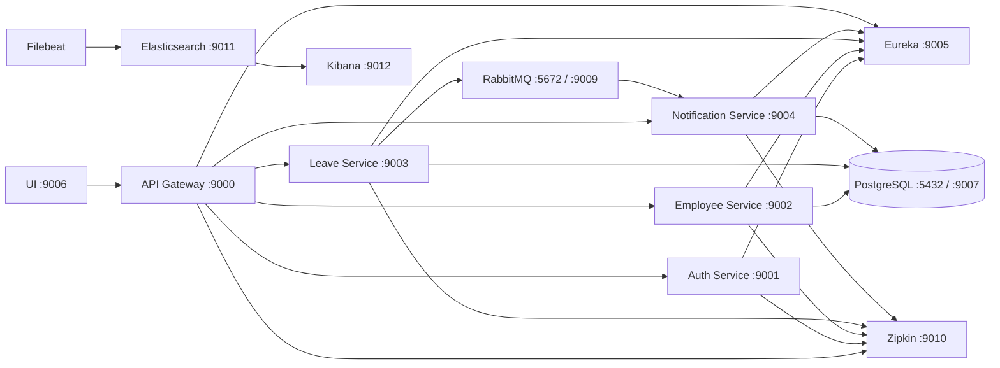

# Architecture Design

This document explains the architecture I implemented for the Employee Leave Tracker assignment.

## Overview

The project is split into independent Spring Boot services. The API Gateway is the public backend entry point. After login, every protected request carries a JWT token. The gateway validates the token and forwards the logged-in user id and role to downstream services.

This keeps authentication centralized while still allowing each service to enforce its own business rules.

## Services

| Service | Port | Responsibility |
| --- | --- | --- |
| `api-gateway` | 9000 | Routes requests, validates JWT, forwards user headers |
| `auth-service` | 9001 | Authenticates seeded users and generates JWT tokens |
| `employee-service` | 9002 | Owns employee records, manager mapping, and leave balances |
| `leave-service` | 9003 | Owns leave requests, validation, history, approval, and rejection |
| `notification-service` | 9004 | Consumes RabbitMQ leave events and stores notification records |
| `discovery-service` | 9005 | Eureka service registry |
| `ui` | 9006 | Simple browser UI for demo |

## Architecture Diagram

## Data Ownership

- `employee-service` owns employee records and leave balances.
- `leave-service` owns leave requests and status transitions.
- `notification-service` owns notification records.
- PostgreSQL is shared in Docker Compose for assignment simplicity, but the services write only to their own tables.

## Security Design

- `POST /auth/login` is public.
- All other APIs require `Authorization: Bearer <token>`.
- JWT contains user id, role, email, issue time, and expiry.
- API Gateway validates the JWT before routing.
- API Gateway forwards `X-User-Id` and `X-User-Role`.
- Employees can view only their own data.
- Managers can view and act only on their assigned team requests.

## Main Business Flow

1. Employee logs in and receives JWT.
2. Employee checks leave balance.
3. Employee applies for leave.
4. Leave service validates date range, manager mapping, balance, and overlapping requests.
5. Leave request is saved as `PENDING`.
6. Leave service publishes a RabbitMQ notification event.
7. Manager approves or rejects the request.
8. On approval, leave service calls employee service to deduct balance.
9. Notification service records the event for the employee or manager.

## Cross-Cutting Concerns

- API Gateway for routing and JWT validation
- Eureka for service discovery
- RabbitMQ for asynchronous notification flow
- Resilience4j circuit breaker around leave-service to employee-service calls
- Spring Actuator health and diagnostic endpoints
- Zipkin for distributed tracing
- Filebeat, Elasticsearch, and Kibana for container log inspection
- Consistent JSON error responses with proper HTTP status codes
